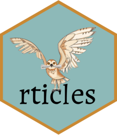

<!-- README.md is generated from README.Rmd. Please edit that file -->

```{r, include = FALSE}
knitr::opts_chunk$set(
  collapse = TRUE,
  comment = "#>",
  fig.path = "man/figures/README-",
  out.width = "100%"
)
```

<!-- badges: start -->

[](https://github.com/rstudio/rticles/actions/workflows/R-CMD-check.yaml)
[](https://cran.r-project.org/package=rticles)
[](https://CRAN.R-project.org/package=rticles)
[](https://app.codecov.io/gh/rstudio/rticles?branch=main)

<!-- badges: end -->

# rticles <a href="https://pkgs.rstudio.com/rticles/"></a>

The **rticles** package provides a suite of custom [R
Markdown](https://rmarkdown.rstudio.com) LaTeX formats and templates for
various formats. Most of the templates are provided and maintained by
the community, and anyone can contribute a new template. See [How to
contribute](#how-to-contribute) below.

## Book

<a href="https://bookdown.org/yihui/rmarkdown/journals.html"></a>

## Installation

You can install and use **rticles** from CRAN as follows:

``` r
install.packages("rticles")
```

If you wish to install the development version from GitHub (which often
contains new article formats), you can do this:

``` r
# install.packages("pak")
pak::pak("rstudio/rticles")
```

## Using rticles

To use **rticles** from RStudio, you can access the templates through
`File -> New File -> R Markdown`. This will open the dialog box where
you can select from one of the available templates:


If you are not using RStudio, you'll also need to install
[Pandoc](https://pandoc.org) following these
[instructions](https://bookdown.org/yihui/rmarkdown-cookbook/install-pandoc.html).
Then, use the `rmarkdown::draft()` function to create articles:

``` r
rmarkdown::draft(
    "MyJSSArticle.Rmd", template = "jss", package = "rticles"
)
rmarkdown::draft(
    "MyRJournalArticle", template = "rjournal", package = "rticles"
)
```

This will create a folder containing a Rmd file using the corresponding
output format and all the assets required by this format.

## Templates

Currently included templates and their contributors are the following:

| Journal                                                                                                                                                                           | Contributors                                                                                                                                                                   | Pull request                                                                                                                                                                                                                                                                                                               | Output format              |
|-----------------------------------------------------------------------------------------------------------------------------------------------------------------------------------|--------------------------------------------------------------------------------------------------------------------------------------------------------------------------------|----------------------------------------------------------------------------------------------------------------------------------------------------------------------------------------------------------------------------------------------------------------------------------------------------------------------------|----------------------------|
| [ACM: Association for Computings Machinery](https://www.acm.org/publications/about-publications)                                                                                  | [\@ramnathv](https://github.com/ramnathv)                                                                                                                                      | [#8](https://github.com/rstudio/rticles/pull/8)                                                                                                                                                                                                                                                                            | `acm_article()`            |
| [ACS](https://pubs.acs.org)                                                                                                                                                       | [\@yufree](https://github.com/yufree)                                                                                                                                          | [#15](https://github.com/rstudio/rticles/pull/15)                                                                                                                                                                                                                                                                          | `acs_article()`            |
| [AEA: American Economic Association](https://www.aeaweb.org/journals/policies/templates)                                                                                          | [\@sboysel](https://github.com/sboysel)                                                                                                                                        | [#86](https://github.com/rstudio/rticles/pull/86)                                                                                                                                                                                                                                                                          | `aea_articles()`           |
| [AGU](https://agupubs.onlinelibrary.wiley.com/)                                                                                                                                   | [\@eliocamp](https://github.com/eliocamp)                                                                                                                                      | [#199](https://github.com/rstudio/rticles/pull/199)                                                                                                                                                                                                                                                                        | `agu_article()`            |
| [AJS: Austrian Journal of Statistics](https://www.ajs.or.at)                                                                                                                      | [\@matthias-da](https://github.com/matthias-da)                                                                                                                                | [#437](https://github.com/rstudio/rticles/pull/437)                                                                                                                                                                                                                                                                        | `ajs_article()`            |
| [AMS: American Meteorological Society](https://www.ametsoc.org/)                                                                                                                  | [\@yufree](https://github.com/yufree)                                                                                                                                          | [#96](https://github.com/rstudio/rticles/pull/96)                                                                                                                                                                                                                                                                          | `ams_article()`            |
| ASA: American Statistical Association `https://www.amstat.org/`                                                                                                                   |                                                                                                                                                                                | [#111](https://github.com/rstudio/rticles/pull/111)                                                                                                                                                                                                                                                                        | `asa_article()`            |
| [arXiv](https://arxiv.org/) pre-prints based on George Kour's template                                                                                                            | [\@alexpghayes](https://github.com)                                                                                                                                            | [#236](https://github.com/rstudio/rticles/pull/236)                                                                                                                                                                                                                                                                        | `arxiv_article()`          |
| [Bioinformatics](https://academic.oup.com/bioinformatics)                                                                                                                         | [\@ShixiangWang](https://github.com/ShixiangWang)                                                                                                                              | [#297](https://github.com/rstudio/rticles/pull/297)                                                                                                                                                                                                                                                                        | `bioinformatics_article()` |
| [Biometrics](https://biometrics.biometricsociety.org)                                                                                                                             | [\@daltonhance](https://github.com/daltonhance)                                                                                                                                | [#170](https://github.com/rstudio/rticles/pull/170)                                                                                                                                                                                                                                                                        | `biometrics_article()`     |
| [Bulletin de l'AMQ](https://www.amq.math.ca/bulletin/)                                                                                                                            | [\@desautm](https://github.com/desautm)                                                                                                                                        | [#145](https://github.com/rstudio/rticles/pull/145)                                                                                                                                                                                                                                                                        | `amq_article()`            |
| [Copernicus Publications](https://publications.copernicus.org)                                                                                                                    | [\@nuest](https://github.com/nuest), [\@RLumSK](https://github.com/RLumSK)                                                                                                     | [#172](https://github.com/rstudio/rticles/pull/172), [#342](https://github.com/rstudio/rticles/pull/342)                                                                                                                                                                                                                   | `copernicus_article()`     |
| [CTeX](https://ctan.org/pkg/ctex)                                                                                                                                                 |                                                                                                                                                                                |                                                                                                                                                                                                                                                                                                                            | `ctex()`                   |
| [Elsevier](https://www.elsevier.com)                                                                                                                                              | [\@cboettig](https://github.com/cboettig), [\@robjhyndman](https://github.com/robjhyndman)                                                                                     | [#27](https://github.com/rstudio/rticles/pull/27), [#467](https://github.com/rstudio/rticles/pull/467)                                                                                                                                                                                                                     | `elsevier_article()`       |
| [Frontiers](https://www.frontiersin.org/)                                                                                                                                         | [\@muschellij2](https://github.com/muschellij2)                                                                                                                                | [#211](https://github.com/rstudio/rticles/pull/211)                                                                                                                                                                                                                                                                        | `frontiers_article()`      |
| [Glossa](https://www.glossa-journal.org)                                                                                                                                          | [\@stefanocoretta](https://github.com/stefanocoretta)                                                                                                                          | [#361](https://github.com/rstudio/rticles/pull/361)                                                                                                                                                                                                                                                                        | `glossa_article()`         |
| [IEEE Transaction](http://www.ieee.org/publications_standards/publications/authors/author_templates.html)                                                                         | [\@Emaasit](https://github.com/Emaasit), [\@espinielli](https://github.com/espinielli), [\@nathanweeks](https://github.com/nathanweeks), [\@DunLug](https://github.com/DunLug) | [#97](https://github.com/rstudio/rticles/pull/97), [#169](https://github.com/rstudio/rticles/pull/169), [#227](https://github.com/rstudio/rticles/pull/227), [#263](https://github.com/rstudio/rticles/pull/263), [#264](https://github.com/rstudio/rticles/pull/264), [#265](https://github.com/rstudio/rticles/pull/265) | `ieee_article()`           |
| [IMS: Institute of Mathematical Statistics](https://imstat.org/) [AoAS: Annals of Applied Statistics](https://imstat.org/journals-and-publications/annals-of-applied-statistics/) | [\@auzaheta](https://github.com/auzaheta)                                                                                                                                      | [#372](https://github.com/rstudio/rticles/pull/372)                                                                                                                                                                                                                                                                        | `ims_article()`            |
| [INFORMS: Institute for Operations Research and the Management Sciences](https://www.informs.org/)                                                                                | [\@robjhyndman](https://github.com/robjhyndman)                                                                                                                                | [#460](https://github.com/rstudio/rticles/pull/460)                                                                                                                                                                                                                                                                        | `informs_article()`        |
| [ISBA: International Society for Bayesian Analysis](https://bayesian.org/)                                                                                                        | [\@dmi3nko](https://github.com/dmi3kno)                                                                                                                                        | [#461](https://github.com/rstudio/rticles/pull/461)                                                                                                                                                                                                                                                                        | `isba_article()`           |
| IOP: Institute of Physics (`https://iopscience.iop.org`)                                                                                                                          | [\@robjhyndman](https://github.com/robjhyndman)                                                                                                                                | [#462](https://github.com/rstudio/rticles/pull/462)                                                                                                                                                                                                                                                                        | `iop_article()`            |
| [JASA: Journal of the Acoustical Society of America](https://asa.scitation.org/journal/jas)                                                                                       | [\@stefanocoretta](https://github.com/stefanocoretta)                                                                                                                          | [#364](https://github.com/rstudio/rticles/pull/364)                                                                                                                                                                                                                                                                        | `jasa_article()`           |
| [Journal of Educational Data Mining](https://jedm.educationaldatamining.org/index.php/JEDM/about/submissions) journal submissions                                                 | [\@jooyoungseo](https://github.com/jooyoungseo)                                                                                                                                | [#251](https://github.com/rstudio/rticles/pull/251)                                                                                                                                                                                                                                                                        | `jedm_article()`           |
| [JOSS: Journal of Open Source Software](https://joss.theoj.org/) [JOSE: Journal of Open Source Education](https://jose.theoj.org/)                                                | [\@noamross](https://github.com/noamross)                                                                                                                                      | [#229](https://github.com/rstudio/rticles/pull/229)                                                                                                                                                                                                                                                                        | `joss_article()`           |
| [JSS: Journal of Statistical Software](https://www.jstatsoft.org/index)                                                                                                           |                                                                                                                                                                                |                                                                                                                                                                                                                                                                                                                            | `jss_article()`            |
| [LIPIcs](https://www.dagstuhl.de/en/publications/lipics)                                                                                                                          | [\@nuest](https://github.com/nuest)                                                                                                                                            | [#288](https://github.com/rstudio/rticles/pull/288)                                                                                                                                                                                                                                                                        | `lipics_article()`         |
| [MDPI](https://www.mdpi.com)                                                                                                                                                      | [\@dleutnant](https://github.com/dleutnant)                                                                                                                                    | [#147](https://github.com/rstudio/rticles/pull/147)                                                                                                                                                                                                                                                                        | `mdpi_article()`           |
| [MNRAS: Monthly Notices of the Royal Astronomical Society](https://academic.oup.com/mnras)                                                                                        | [\@oleskiewicz](https://github.com/oleskiewicz)                                                                                                                                | [#175](https://github.com/rstudio/rticles/pull/175)                                                                                                                                                                                                                                                                        | `mnras_article()`          |
| [OUP: Oxford University Press](https://academic.oup.com/pages/authoring/journals/preparing_your_manuscript)                                                                       | [\@dmkaplan](https://github.com/dmkaplan)                                                                                                                                      | [#284](https://github.com/rstudio/rticles/pull/284)                                                                                                                                                                                                                                                                        | `oup_articles()`           |
| [PeerJ: Journal of Life and Environmental Sciences](https://peerj.com)                                                                                                            | [\@zkamvar](https://github.com/zkamvar)                                                                                                                                        | [#127](https://github.com/rstudio/rticles/pull/127)                                                                                                                                                                                                                                                                        | `peerj_article()`          |
| [PiHPh: Papers in Historical Phonology](http://journals.ed.ac.uk/pihph/about/submissions)                                                                                         | [\@stefanocoretta](https://github.com/stefanocoretta)                                                                                                                          | [#362](https://github.com/rstudio/rticles/pull/362)                                                                                                                                                                                                                                                                        | `pihph_article()`          |
| [PLOS](https://plos.org/#journals)                                                                                                                                                | [\@sjmgarnier](https://github.com/sjmgarnier)                                                                                                                                  | [#12](https://github.com/rstudio/rticles/pull/12)                                                                                                                                                                                                                                                                          | `plos_article()`           |
| [PNAS: Proceedings of the National Academy of Sciences](https://www.pnas.org/)                                                                                                    | [\@cboettig](https://github.com/cboettig)                                                                                                                                      | [#72](https://github.com/rstudio/rticles/pull/72)                                                                                                                                                                                                                                                                          | `pnas_article()`           |
| [RSOS: Royal Society Open Science](https://www.royalsocietypublishing.org/journal/rsos)                                                                                           | [\@ThierryO](https://github.com/ThierryO)                                                                                                                                      | [#135](https://github.com/rstudio/rticles/pull/135)                                                                                                                                                                                                                                                                        | `rsos_article()`           |
| [RSS: Royal Statistical Society](https://rss.org.uk/)                                                                                                                             | [\@carlganz](https://github.com/carlganz)                                                                                                                                      | [#110](https://github.com/rstudio/rticles/pull/110)                                                                                                                                                                                                                                                                        | `rss_article()`            |
| [Sage](https://uk.sagepub.com/en-gb/eur/manuscript-submission-guidelines)                                                                                                         | [\@oguzhanogreden](https://github.com/oguzhanogreden)                                                                                                                          | [#181](https://github.com/rstudio/rticles/pull/181)                                                                                                                                                                                                                                                                        | `sage_article()`           |
| [Springer](https://www.springernature.com/gp/authors/campaigns/latex-author-support)                                                                                              | [\@strakaps](https://github.com/strakaps)                                                                                                                                      | [#164](https://github.com/rstudio/rticles/pull/164)                                                                                                                                                                                                                                                                        | `springer_article()`       |
| [Springer Lecture Notes in Computer Science (LCNS)](https://www.springer.com/gp/computer-science/lncs/conference-proceedings-guidelines)                                          | [\@eliocamp](https://github.com/eliocamp/)                                                                                                                                     | [#445](https://github.com/rstudio/rticles/issues/445)                                                                                                                                                                                                                                                                      | `lncs_article()`           |
| [SIM: Statistics in Medicine](https://onlinelibrary.wiley.com/journal/10970258)                                                                                                   | [\@ellessenne](https://github.com/ellessenne)                                                                                                                                  | [#231](https://github.com/rstudio/rticles/pull/231)                                                                                                                                                                                                                                                                        | `sim_article()`            |
| [Taylor & Francis](https://www.tandfonline.com/)                                                                                                                                  | [\@dleutnant](https://github.com/dleutnant)                                                                                                                                    | [#218](https://github.com/rstudio/rticles/pull/218)                                                                                                                                                                                                                                                                        | `tf_article()`             |
| [The R Journal](https://journal.r-project.org/)                                                                                                                                   |                                                                                                                                                                                |                                                                                                                                                                                                                                                                                                                            | `rjournal_article()`       |
| [TRB](https://trb.secure-platform.com/a/page/TRBPaperReview)                                                                                                                      | [\@gregmacfarlane](https://github.com/gregmacfarlane)                                                                                                                          | [#427](https://github.com/rstudio/rticles/pull/427)                                                                                                                                                                                                                                                                        | `trb_article()`            |
| [Wellcome Open Research](https://wellcomeopenresearch.org)                                                                                                                        | [\@arnold-c](https://github.com/arnold-c)                                                                                                                                      | [#436](https://github.com/rstudio/rticles/pull/436)                                                                                                                                                                                                                                                                        | `wellcomeor_article()`     |

You can also get the list of available journal names with
`rticles::journals()`.

```{r}
rticles::journals()
```

Those are the values to use within `rmarkdown::draft()`.

Under the hood, LaTeX templates are used to ensure that documents
conform precisely to submission standards. At the same time, composition
and formatting can be done using lightweight
[markdown](https://rmarkdown.rstudio.com/authoring_basics.html) syntax,
and R code and its output can be seamlessly included using
[knitr](https://yihui.org/knitr/).

## Getting help

There are two main places to get help:

1.  The [RStudio
    community](https://community.rstudio.com/tags/c/R-Markdown/10/rticles)
    is a friendly place to ask any questions about **rticles**. Be sure
    to use the `rticles` tag.

2.  [Stack Overflow](https://stackoverflow.com/questions/tagged/rticles)
    is a great source of answers to common **bookdown** questions. Use
    the tags
    [`[r][rticles]`](https://stackoverflow.com/questions/tagged/rticles+r)
    if you ask a question.

## Code of Conduct

Please note that the rticles project is released with a [Contributor
Code of Conduct](https://pkgs.rstudio.com/rticles/CODE_OF_CONDUCT.html).
By contributing to this project, you agree to abide by its terms.

## How to contribute? {#how-to-contribute}

Most of the templates are contributed directly by the users in the
community. If you want **rticles** to offer a new journal format, you
can contribute by the following way.

### Suggest an idea for new format opening an issue.

You may not feel confident enough or may not have time to contribute a
new format. By opening a new issue, you can share the idea for this
format, and see if someone in the community can help on it.\
This is not the best way to quickly get your format included but at
least it is a great way to see if others are interested too.

To see the existing suggested formats, just filter issues with the [help
wanted
:heart:](https://github.com/rstudio/rticles/labels/help%20wanted%20%3Aheart%3A)
label. You can then add a :+1: or help to add the template :wink:.

### Contribute a new template format opening a pull request.

To contribute a new format, you need to open a new pull request (PR).
When opening the PR, you'll see the [PR
template](https://pkgs.rstudio.com/rticles/PULL_REQUEST_TEMPLATE.html)
explaining how to proceed and what is important to check. Please follow
it.\
Even if you are just starting or you are not finished, you share your
work by creating a [draft
PR](https://docs.github.com/en/github/collaborating-with-issues-and-pull-requests/about-pull-requests#draft-pull-requests).
It is a great way to let us know that you are still working on it (like
[these opened
ones](https://github.com/rstudio/rticles/pulls?q=is%3Apr+draft%3Atrue+)),
and it is also a great way to ask for help from the community.\
When you are ready, you can submit the PR for review, and we will
iterate until it is merged.

#### Technical resources helpful to contribute a template

The best way to get started is to look at the previous examples of
submitted PR. You'll find links to them in the table [above](#overview).

All the `rticles` format are build similarly by providing a new pandoc
tex template to replace the default one. You'll learn more about pandoc
templates in these places:

-   [R Markdown
    Cookbook](https://bookdown.org/yihui/rmarkdown-cookbook/latex-template.html)
-   [The Pandoc manual](https://pandoc.org/MANUAL.html#templates)

You can study [existing
formats](https://github.com/rstudio/rticles/tree/main/inst/rmarkdown/templates)
to see how all this works.
