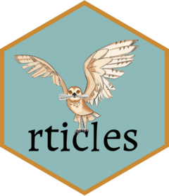

<!-- README.md is generated from README.Rmd. Please edit that file -->
<!-- badges: start -->

[](https://github.com/rstudio/rticles/actions/workflows/R-CMD-check.yaml)
[](https://cran.r-project.org/package=rticles)
[](https://CRAN.R-project.org/package=rticles)
[](https://app.codecov.io/gh/rstudio/rticles?branch=main)

<!-- badges: end -->

# rticles <a href="https://pkgs.rstudio.com/rticles/"></a>

The **rticles** package provides a suite of custom [R
Markdown](https://rmarkdown.rstudio.com) LaTeX formats and templates for
various formats. Most of the templates are provided and maintained by
the community, and anyone can contribute a new template. See [How to
contribute](#how-to-contribute) below.

## Book

<a href="https://bookdown.org/yihui/rmarkdown/journals.html"></a>

## Installation

You can install and use **rticles** from CRAN as follows:

``` r
install.packages("rticles")
```

If you wish to install the development version from GitHub (which often
contains new article formats), you can do this:

``` r
# install.packages("pak")
pak::pak("rstudio/rticles")
```

## Using rticles

To use **rticles** from RStudio, you can access the templates through
`File -> New File -> R Markdown`. This will open the dialog box where
you can select from one of the available templates:

<figure>

<figcaption aria-hidden="true">New R Markdown</figcaption>
</figure>

If you are not using RStudio, you’ll also need to install
[Pandoc](https://pandoc.org) following these
[instructions](https://bookdown.org/yihui/rmarkdown-cookbook/install-pandoc.html).
Then, use the `rmarkdown::draft()` function to create articles:

``` r
rmarkdown::draft(
    "MyJSSArticle.Rmd", template = "jss", package = "rticles"
)
rmarkdown::draft(
    "MyRJournalArticle", template = "rjournal", package = "rticles"
)
```

This will create a folder containing a Rmd file using the corresponding
output format and all the assets required by this format.

## Templates

Currently included templates and their contributors are the following:

<table style="width:97%;">
<colgroup>
<col style="width: 19%" />
<col style="width: 19%" />
<col style="width: 38%" />
<col style="width: 19%" />
</colgroup>
<thead>
<tr class="header">
<th>Journal</th>
<th>C ontributors</th>
<th>Pull request</th>
<th>Output format</th>
</tr>
</thead>
<tbody>
<tr class="odd">
<td><a
href="https://%20www.acm.org%20/publicatio%20ns/about-pu%20blications">ACM:
Association for Computings Machiner y</a></td>
<td><a href="https:%20//github.co%20m/ramnathv">@ramna thv</a></td>
<td><a href="https://github.co%20m/rstudio/rticles/pull/8">#8</a></td>
<td><code>acm _article()</code></td>
</tr>
<tr class="even">
<td>ACS <code>https://pu bs.acs.org</code></td>
<td><a href="http%20s://github.%20com/yufree">@y ufree</a></td>
<td><a href="https://github.com%20/rstudio/rticles/pull/15">#15</a></td>
<td><code>acs _article()</code></td>
</tr>
<tr class="odd">
<td><a
href="https:/%20/www.aeaweb%20.org/journa%20ls/policies%20/templates">AEA:
American Economic Associati on</a></td>
<td><a href="https%20://github.c%20om/sboysel">@sbo ysel</a></td>
<td><a href="https://github.com%20/rstudio/rticles/pull/86">#86</a></td>
<td><code>aea_ articles()</code></td>
</tr>
<tr class="even">
<td>AGU <code>https:// agupubs.onl inelibrary. wiley.com/</code></td>
<td><a href="https:%20//github.co%20m/eliocamp">@elioc amp</a></td>
<td><a
href="https://github.com/%20rstudio/rticles/pull/199">#199</a></td>
<td><code>agu _article()</code></td>
</tr>
<tr class="odd">
<td><a href="https://www%20.ajs.or.at">AJS: Austrian Journal of S
tatistics</a></td>
<td><a href="https://g%20ithub.com/m%20atthias-da">@
matthias-da</a></td>
<td><a
href="https://github.com/%20rstudio/rticles/pull/437">#437</a></td>
<td><code>ajs _article()</code></td>
</tr>
<tr class="even">
<td><a href="htt%20ps://www.am%20etsoc.org/">AMS: American Met
eorological S ociety</a></td>
<td><a href="http%20s://github.%20com/yufree">@y ufree</a></td>
<td><a href="https://github.com%20/rstudio/rticles/pull/96">#96</a></td>
<td><code>ams _article()</code></td>
</tr>
<tr class="odd">
<td>ASA: American Statistical Association
<code>ht tps://www.a mstat.org/</code></td>
<td></td>
<td><a
href="https://github.com/%20rstudio/rticles/pull/111">#111</a></td>
<td><code>asa _article()</code></td>
</tr>
<tr class="even">
<td><a href="https://%20arxiv.org/">arXi v</a> pre-prints based on
George Kour’s template</td>
<td><a href="https://%20github.com"><br />
<span class="citation" data-cites="alexpghaye">@alexpghaye</span>
s</a></td>
<td><a
href="https://github.com/%20rstudio/rticles/pull/236">#236</a></td>
<td><code>arxiv _article()</code></td>
</tr>
<tr class="odd">
<td><a href="https:/%20/academic.o%20up.com/bioi%20nformatics">B
ioinformati cs</a></td>
<td>[@Sh ixiangWang] (<a href="https://gi" class="uri">https://gi</a>
thub.com/Sh ixiangWang)</td>
<td><a
href="https://github.com/%20rstudio/rticles/pull/297">#297</a></td>
<td><code>bio informatics _article()</code></td>
</tr>
<tr class="even">
<td><a href="https:/%20/biometrics%20.biometrics%20ociety.org">Biometri
cs</a></td>
<td><a href="https://g%20ithub.com/d%20altonhance">@
daltonhance</a></td>
<td><a
href="https://github.com/%20rstudio/rticles/pull/170">#170</a></td>
<td><code>biometrics _article()</code></td>
</tr>
<tr class="odd">
<td><a href="h%20ttps://www.%20amq.math.ca%20/bulletin/">Bulletin de
l’AMQ</a></td>
<td><a href="https%20://github.c%20om/desautm">@des autm</a></td>
<td><a
href="https://github.com/%20rstudio/rticles/pull/145">#145</a></td>
<td><code>amq _article()</code></td>
</tr>
<tr class="even">
<td><a href="htt%20ps://public%20ations.cope%20rnicus.org">Copernicus
Public ations</a></td>
<td><a href="http%20s://github.%20com/nuest">@ nuest</a>, <a
href="http%20s://github.%20com/RLumSK">@R LumSK</a></td>
<td><a href="https://github.com/r%20studio/rticles/pull/172"># 172</a>,
<a href="https://github.com/%20rstudio/rticles/pull/342">#342</a></td>
<td><code>copernicus _article()</code></td>
</tr>
<tr class="odd">
<td><a href="http%20s://ctan.or%20g/pkg/ctex">CTeX</a></td>
<td></td>
<td></td>
<td><code>ctex()</code></td>
</tr>
<tr class="even">
<td><a href="htt%20ps://www.el%20sevier.com">El sevier</a></td>
<td><a href="https:/%20/github.com%20/cboettig">@cboett ig</a>, <a
href="https://g%20ithub.com/r%20objhyndman">@ robjhyndman</a></td>
<td><a href="https://github.com/%20rstudio/rticles/pull/27">#27</a>, <a
href="https://github.com/%20rstudio/rticles/pull/467">#467</a></td>
<td><code>elsevier _article()</code></td>
</tr>
<tr class="odd">
<td><a href="https:/%20/www.fronti%20ersin.org/">Frontie rs</a></td>
<td><a href="https://g%20ithub.com/m%20uschellij2">@
muschellij2</a></td>
<td><a
href="https://github.com/%20rstudio/rticles/pull/211">#211</a></td>
<td><code>frontiers _article()</code></td>
</tr>
<tr class="even">
<td><a href="https://w%20ww.glossa-j%20ournal.org">Glossa</a></td>
<td><a href="h%20ttps://gith%20ub.com/stef%20anocoretta">@stefan
ocoretta</a></td>
<td><a
href="https://github.com/%20rstudio/rticles/pull/361">#361</a></td>
<td><code>glossa _article()</code></td>
</tr>
<tr class="odd">
<td><a
href="http://ww%20w.ieee.org/%20publication%20s_standards%20/publicatio%20ns/authors/%20author_temp%20lates.html">IEEE
Transaction</a></td>
<td><a href="https:%20//github.co%20m/Emaasit">@Emaa sit</a>, <a
href="https://g%20ithub.com/e%20spinielli"><br />
<span class="citation" data-cites="espinielli">@espinielli</span></a>,
[@n athanweeks] (<a href="https://gi" class="uri">https://gi</a>
thub.com/na thanweeks), <a href="http%20s://github.%20com/DunLug">@D
unLug</a></td>
<td><a href="https://github.com/%20rstudio/rticles/pull/97">#97</a>, <a
href="https://github.com/r%20studio/rticles/pull/169"># 169</a>, <a
href="https://github.com/r%20studio/rticles/pull/227"># 227</a>, <a
href="https://github.com/r%20studio/rticles/pull/263"># 263</a>, <a
href="https://github.com/r%20studio/rticles/pull/264"># 264</a>, <a
href="https://github.com/%20rstudio/rticles/pull/265">#265</a></td>
<td><code>ieee _article()</code></td>
</tr>
<tr class="even">
<td><a href="https://i%20mstat.org/">IMS: Institute of M athematical
Statistics</a> <a
href="https://i%20mstat.org/j%20ournals-and%20-publicatio%20ns/annals-o%20f-applied-s%20tatistics/">AoAS:
Annals of Applied Statistics</a></td>
<td><a href="https:%20//github.co%20m/auzaheta">@auzah eta</a></td>
<td><a
href="https://github.com/%20rstudio/rticles/pull/372">#372</a></td>
<td><code>ims _article()</code></td>
</tr>
<tr class="odd">
<td><a href="htt%20ps://www.in%20forms.org/">INFORMS: Institute for
Operations Research and the Management Sc iences</a></td>
<td><a href="https://g%20ithub.com/r%20objhyndman">@
robjhyndman</a></td>
<td><a
href="https://github.com/%20rstudio/rticles/pull/460">#460</a></td>
<td><code>informs _article()</code></td>
</tr>
<tr class="even">
<td><a href="https://bay%20esian.org/">ISBA: In ternational Society for
Bayesian Analysis</a></td>
<td><a href="https%20://github.c%20om/dmi3kno">@dmi 3nko</a></td>
<td><a
href="https://github.com/%20rstudio/rticles/pull/461">#461</a></td>
<td><code>isba _article()</code></td>
</tr>
<tr class="odd">
<td>IOP: Institute of Physics
(<code>https: //iopscienc e.iop.org</code>)</td>
<td><a href="https://g%20ithub.com/r%20objhyndman">@
robjhyndman</a></td>
<td><a
href="https://github.com/%20rstudio/rticles/pull/462">#462</a></td>
<td><code>iop _article()</code></td>
</tr>
<tr class="even">
<td><a href="https://%20pubs.aip.or%20g/asa/jasa">JASA: Journal of the
Acoustical Society of Americ a</a></td>
<td><a href="h%20ttps://gith%20ub.com/stef%20anocoretta">@stefan
ocoretta</a></td>
<td><a
href="https://github.com/%20rstudio/rticles/pull/364">#364</a></td>
<td><code>jasa _article()</code></td>
</tr>
<tr class="odd">
<td><a
href="https:%20//jedm.educ%20ationaldata%20mining.org/%20index.php/J%20EDM/about/s%20ubmissions">Journal
of Educational Data Min ing</a> journal submissions</td>
<td><a href="https://g%20ithub.com/j%20ooyoungseo">@
jooyoungseo</a></td>
<td><a
href="https://github.com/%20rstudio/rticles/pull/251">#251</a></td>
<td><code>jedm _article()</code></td>
</tr>
<tr class="even">
<td><a href="ht%20tps://joss.%20theoj.org/">JOSS: Journal of Open Source
S oftware</a> <a href="ht%20tps://jose.%20theoj.org/">JOSE: Journal of
Open Source Ed ucation</a></td>
<td><a href="https:%20//github.co%20m/noamross">@noamr oss</a></td>
<td><a
href="https://github.com/%20rstudio/rticles/pull/229">#229</a></td>
<td><code>joss _article()</code></td>
</tr>
<tr class="odd">
<td>[JSS: Journal of Statistical Software] (<a href="https://ww"
class="uri">https://ww</a> w.jstatsoft .org/index)</td>
<td></td>
<td></td>
<td><code>jss _article()</code></td>
</tr>
<tr class="even">
<td><a
href="https%20://www.dags%20tuhl.de/en/%20publishing/%20series/deta%20ils/lipics">LI
PIcs</a></td>
<td><a href="htt%20ps://github%20.com/nuest"><br />
<span class="citation" data-cites="nuest">@nuest</span></a></td>
<td><a
href="https://github.com/%20rstudio/rticles/pull/288">#288</a></td>
<td><code>lipics _article()</code></td>
</tr>
<tr class="odd">
<td>[MDPI] (<a href="https://ww" class="uri">https://ww</a>
w.mdpi.com)</td>
<td><a href="https://%20github.com/%20dleutnant">@dleutnan t</a>, <a
href="https%20://github.c%20om/mps9506">@mps 9506</a></td>
<td><a href="https://github.com/r%20studio/rticles/pull/147"># 147</a>,
<a href="https://github.com/%20rstudio/rticles/pull/515">#515</a></td>
<td><code>mdpi _article()</code></td>
</tr>
<tr class="even">
<td><a href="https://a%20cademic.oup%20.com/mnras">MNRAS: Monthly
Notices of the Royal A stronomical Society</a></td>
<td><a href="https://g%20ithub.com/o%20leskiewicz">@
oleskiewicz</a></td>
<td><a
href="https://github.com/%20rstudio/rticles/pull/175">#175</a></td>
<td><code>mnras _article()</code></td>
</tr>
<tr class="odd">
<td>[OUP: Oxford University Press] (<a href="https://ac"
class="uri">https://ac</a> ademic.oup. com/pages/a uthoring/jo
urnals/prep aring_your_ manuscript)</td>
<td><a href="https:%20//github.co%20m/dmkaplan">@dmkap lan</a></td>
<td><a
href="https://github.com/%20rstudio/rticles/pull/284">#284</a></td>
<td><code>oup_ articles()</code></td>
</tr>
<tr class="even">
<td><a href="https:/%20/peerj.com">PeerJ: Journal of Life and En
vironmental Scienc es</a></td>
<td><a href="https%20://github.c%20om/zkamvar">@zka mvar</a></td>
<td><a
href="https://github.com/%20rstudio/rticles/pull/127">#127</a></td>
<td><code>peerj _article()</code></td>
</tr>
<tr class="odd">
<td><a
href="http:%20//journals.%20ed.ac.uk/pi%20hph/about/s%20ubmissions">PiHPh:
Papers in Historical Phono logy</a></td>
<td><a href="h%20ttps://gith%20ub.com/stef%20anocoretta">@stefan
ocoretta</a></td>
<td><a
href="https://github.com/%20rstudio/rticles/pull/362">#362</a></td>
<td><code>pihph _article()</code></td>
</tr>
<tr class="even">
<td><a href="https%20://plos.org%20/#journals">PLOS</a></td>
<td><a href="https://%20github.com/%20sjmgarnier">@sjmgarnie r</a></td>
<td><a href="https://github.com%20/rstudio/rticles/pull/12">#12</a></td>
<td><code>plos _article()</code></td>
</tr>
<tr class="odd">
<td><a href="https://www%20.pnas.org/">PNAS: Proceedings of the National
Academy of Sciences</a></td>
<td><a href="https:%20//github.co%20m/cboettig">@cboet tig</a></td>
<td><a href="https://github.com%20/rstudio/rticles/pull/72">#72</a></td>
<td><code>pnas _article()</code></td>
</tr>
<tr class="even">
<td>RSOS: Royal Society Open Science
<code>https:// www.royalso cietypublis hing.org/jo urnal/rsos</code></td>
<td><a href="https:%20//github.co%20m/ThierryO">@Thier ryO</a></td>
<td><a
href="https://github.com/%20rstudio/rticles/pull/135">#135</a></td>
<td><code>rsos _article()</code></td>
</tr>
<tr class="odd">
<td><a href="https://r%20ss.org.uk/">RSS: Royal Statistical
Society</a></td>
<td><a href="https:%20//github.co%20m/carlganz">@carlg anz</a></td>
<td><a
href="https://github.com/%20rstudio/rticles/pull/110">#110</a></td>
<td><code>rss _article()</code></td>
</tr>
<tr class="even">
<td><a
href="https://uk.%20sagepub.com%20/en-gb/eur/%20manuscript-%20submission-%20guidelines">Sage</a></td>
<td><a href="h%20ttps://gith%20ub.com/oguz%20hanogreden">@oguzha
nogreden</a></td>
<td><a
href="https://github.com/%20rstudio/rticles/pull/181">#181</a></td>
<td><code>sage _article()</code></td>
</tr>
<tr class="odd">
<td><a
href="https:/%20/www.spring%20ernature.co%20m/gp/author%20s/campaigns%20/latex-auth%20or-support">Spring
er</a></td>
<td><a href="https:%20//github.co%20m/strakaps">@strak aps</a></td>
<td><a
href="https://github.com/%20rstudio/rticles/pull/164">#164</a></td>
<td><code>springer _article()</code></td>
</tr>
<tr class="even">
<td><a
href="https:/%20/www.spring%20er.com/gp/c%20omputer-sci%20ence/lncs/c%20onference-p%20roceedings-%20guidelines">Springer
Lecture Notes in Computer Science (LCN S)</a></td>
<td><a href="https:/%20/github.com%20/eliocamp/">@elioca mp</a></td>
<td><a href="https://github.com/rs%20tudio/rticles/issues/445">#4
45</a></td>
<td><code>lncs _article()</code></td>
</tr>
<tr class="odd">
<td>SIM: Statistics in Medicine
<code>https: //onlinelib rary.wiley. com/journal /10970258)</code></td>
<td><a href="https://%20github.com/%20ellessenne">@ellessenn e</a></td>
<td><a
href="https://github.com/%20rstudio/rticles/pull/231">#231</a></td>
<td><code>sim _article()</code></td>
</tr>
<tr class="even">
<td><a href="https:/%20/www.tandfo%20nline.com/">Taylor &amp; Franc
is</a></td>
<td><a href="https:/%20/github.com%20/dleutnant">@dleutna nt</a></td>
<td><a
href="https://github.com/%20rstudio/rticles/pull/218">#218</a></td>
<td><code>tf _article()</code></td>
</tr>
<tr class="odd">
<td><a href="https://j%20ournal.r-pr%20oject.org/">The R
Journal</a></td>
<td></td>
<td></td>
<td><p>Use <a
href="https://r%20journal.git%20hub.io/rjto%20ols/article%20s/create_ar%20ticle.html"><strong>rjtools</strong></a>
package now</p>
<p><code>rjournal _article()</code> ( deprecated)</p></td>
</tr>
<tr class="even">
<td>[TRB] (<a href="https://tr" class="uri">https://tr</a> b.secure-pl
atform.com/ a/page/TRBP aperReview)</td>
<td><a href="h%20ttps://gith%20ub.com/greg%20macfarlane">@gregma
cfarlane</a></td>
<td><a
href="https://github.com/%20rstudio/rticles/pull/427">#427</a></td>
<td><code>trb _article()</code></td>
</tr>
<tr class="odd">
<td><a href="https://wel%20lcomeopenre%20search.org">Wellcome Open
Research</a></td>
<td><a href="https:%20//github.co%20m/arnold-c">@arnol d-c</a></td>
<td><a
href="https://github.com/%20rstudio/rticles/pull/436">#436</a></td>
<td><code>wellcomeor _article()</code></td>
</tr>
</tbody>
</table>

You can also get the list of available journal names with
`rticles::journals()`.

``` r
rticles::journals()
#>  [1] "acm"            "acs"            "aea"            "agu"           
#>  [5] "ajs"            "amq"            "ams"            "arxiv"         
#>  [9] "asa"            "bioinformatics" "biometrics"     "copernicus"    
#> [13] "ctex"           "elsevier"       "frontiers"      "glossa"        
#> [17] "ieee"           "ims"            "informs"        "iop"           
#> [21] "isba"           "jasa"           "jedm"           "joss"          
#> [25] "jss"            "lipics"         "lncs"           "mdpi"          
#> [29] "mnras"          "oup_v0"         "oup_v1"         "peerj"         
#> [33] "pihph"          "plos"           "pnas"           "rjournal"      
#> [37] "rsos"           "rss"            "sage"           "sim"           
#> [41] "springer"       "tf"             "trb"            "wellcomeor"
```

Those are the values to use within `rmarkdown::draft()`.

Under the hood, LaTeX templates are used to ensure that documents
conform precisely to submission standards. At the same time, composition
and formatting can be done using lightweight
[markdown](https://rmarkdown.rstudio.com/authoring_basics.html) syntax,
and R code and its output can be seamlessly included using
[knitr](https://yihui.org/knitr/).

## Getting help

There are two main places to get help:

1.  The [RStudio
    community](https://community.rstudio.com/tags/c/R-Markdown/10/rticles)
    is a friendly place to ask any questions about **rticles**. Be sure
    to use the `rticles` tag.

2.  [Stack Overflow](https://stackoverflow.com/questions/tagged/rticles)
    is a great source of answers to common **bookdown** questions. Use
    the tags
    [`[r][rticles]`](https://stackoverflow.com/questions/tagged/rticles+r)
    if you ask a question.

## Code of Conduct

Please note that the rticles project is released with a [Contributor
Code of Conduct](https://pkgs.rstudio.com/rticles/CODE_OF_CONDUCT.html).
By contributing to this project, you agree to abide by its terms.

## How to contribute?

Most of the templates are contributed directly by the users in the
community. If you want **rticles** to offer a new journal format, you
can contribute by the following way.

### Suggest an idea for new format opening an issue.

You may not feel confident enough or may not have time to contribute a
new format. By opening a new issue, you can share the idea for this
format, and see if someone in the community can help on it.  
This is not the best way to quickly get your format included but at
least it is a great way to see if others are interested too.

To see the existing suggested formats, just filter issues with the [help
wanted
:heart:](https://github.com/rstudio/rticles/labels/help%20wanted%20%3Aheart%3A)
label. You can then add a :+1: or help to add the template :wink:.

### Contribute a new template format opening a pull request.

To contribute a new format, you need to open a new pull request (PR).
When opening the PR, you’ll see the [PR
template](https://pkgs.rstudio.com/rticles/PULL_REQUEST_TEMPLATE.html)
explaining how to proceed and what is important to check. Please follow
it.  
Even if you are just starting or you are not finished, you share your
work by creating a [draft
PR](https://docs.github.com/en/github/collaborating-with-issues-and-pull-requests/about-pull-requests#draft-pull-requests).
It is a great way to let us know that you are still working on it (like
[these opened
ones](https://github.com/rstudio/rticles/pulls?q=is%3Apr+draft%3Atrue+)),
and it is also a great way to ask for help from the community.  
When you are ready, you can submit the PR for review, and we will
iterate until it is merged.

#### Technical resources helpful to contribute a template

The best way to get started is to look at the previous examples of
submitted PR. You’ll find links to them in the table [above](#overview).

All the `rticles` format are build similarly by providing a new pandoc
tex template to replace the default one. You’ll learn more about pandoc
templates in these places:

- [R Markdown
  Cookbook](https://bookdown.org/yihui/rmarkdown-cookbook/latex-template.html)
- [The Pandoc manual](https://pandoc.org/MANUAL.html#templates)

You can study [existing
formats](https://github.com/rstudio/rticles/tree/main/inst/rmarkdown/templates)
to see how all this works.
