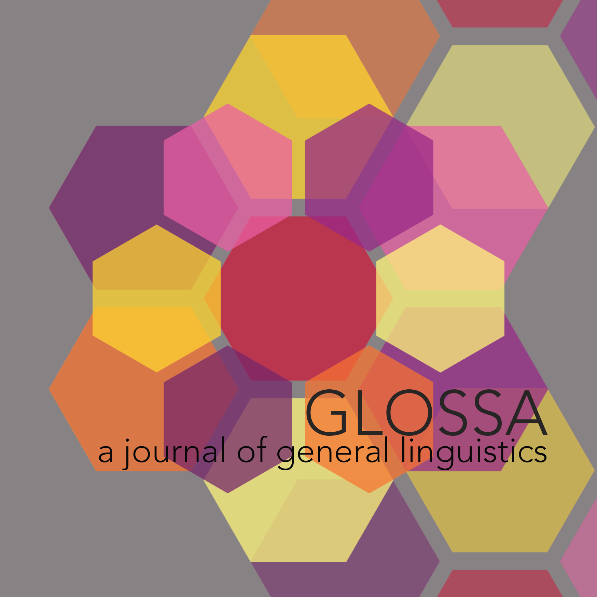

```{r setup, include=FALSE}
knitr::opts_chunk$set(echo = FALSE)
```

# Author guidelines

## Submission information

Submissions should be made electronically through the [Glossa
website](http://glossa.ubiquitypress.com).

Prior to submission, please add a word count (including footnotes and
references) directly under the paper title. Then convert your paper into
a single PDF file, containing all tables and figures. Non-PDF files or
separately provided files may be returned prior to review. Separate
image files may be requested if the submission is accepted for
publication.

Please ensure that you consider the following guidelines when preparing
your manuscript. Failure to do so may delay the processing of your
submission. A downloadable version of the style guide is available
[`here`](https://github.com/guidovw/Glossalatex/blob/master/glossa-template.pdf).
Text formatting in accordance with the stylesheet is required for the
accepted version only.

For LaTeX submissions, please download the Latex resources
[`here`](https://github.com/guidovw/Glossalatex).

All files must be anonymised during the initial submission (including
information in the file properties). Only after editorial acceptance
should you add author details to the manuscript files.

Once a submission has been completed, the submitting author is able to
fully track the status of the paper and complete requested revisions via
their online profile.

## Article types

### Research articles

Research articles must describe the outcomes and application of
unpublished original research. These should make a substantial
contribution to knowledge and understanding in the subject matter and
should be supported by relevant examples, figures and tabulated data.
Research articles must be no more than 13,000 words in length. Authors
are allowed to add appendices with supplementary material that will be
hosted separately from the article itself, and receive their own,
properly referenced, DOI. These materials will not be typeset. See below
on how to provide supplementary/data files.

### Overview articles

Overview articles must describe the state-of-the art in a given
subdiscipline or a specific topic in linguistics. They should be very
accessible, aimed at an audience of MA students or interested
colleagues. Overview articles must be no more than 13,000 words in
length. Authors are allowed to add appendices with supplementary
material that will be hosted separately from the article itself, and
receive their own, properly referenced, DOI. These materials will not be
typeset. See below on how to provide supplementary/data files.

### Book reviews

Book reviews present critical appraisals of recent books in linguistics,
with a preference for monographs, handbooks, and grammars. They can
cover topics such as current controversies or the historical development
of studies as well as issues of regional or temporal focus. Papers
should critically engage with the relevant body of extant literature.
Book reviews should be no longer than 3,000 words in length.

### Review articles

Review articles present longer critical appraisals of one or more recent
books containing an original contribution or perspective on the book(s)
reviewed. Review articles will be reviewed by the editors and/ or
members of the editorial board. Review articles should be no longer than
6,000 words in length.

### Squibs

Squibs are short notes (5,000 words max.) that make a scintillating
point by calling attention to a theoretically unexpected observation
about language, without the need for a developed analysis or solution.

### Special Collections

Special Collections are papers devoted to a particular topic, and edited
by a team of guest editors. Contributions to special collections are
subject to the normal process of blind peer review. Upon publication,
papers within a special collection will be collated within their own
special collection page. If you are interested in submitting or
guest-editing a Special Collection, please contact [the
editors](https://www.glossa-journal.org/about/editorialteam/).

### Word limits

All word limits mentioned above include referencing and citation, but
they exclude appendices, data files and other supplementary material.
Please note that if you have data or supplementary files, they should be
treated as outlined in the section **data availability/supplementary
files** below, and not as part of the main submission file.

## Permissions

The author is responsible for obtaining all permissions required prior
to submission of the manuscript. Permission and owner details should be
mentioned for all third-party content included in the submission or used
in the research.

If a method or tool is introduced in the study, including software,
questionnaires, and scales, the license this is available under and any
requirement for permission for use should be stated. If an existing
method or tool is used in the research, it is the author's
responsibility to check the license and obtain the necessary
permissions.

# Style sheet {#ss}

The Glossa style sheet is based on the [The Generic Style Rules for
Linguistics](http://www.eva.mpg.de/linguistics/past-research-resources/resources/generic-style-rules.html)
(December 2014 version), developed under a CC-BY licence by Martin
Haspelmath. It was slightly modified for Glossa by Waltraud Paul and
Guido Vanden Wyngaerd in November 2015, and again in May 2021.

## Structure

### Title page

The title should not contain any capitalisation apart from the first
word and words that need capitals in any context. In the final version
of the accepted paper, the title is followed by the first and last name
of the author(s), their affiliation, and e-mail. First names should not
include only initials.

Anonymisation: The names of all authors, affiliations, contact details,
biography (optional) and the corresponding author details must be
completed online as part of the submission process but should not be
added to the submitted files until after editorial acceptance.

### Abstract

Articles must have the main text prefaced by an abstract of no more than
250 words summarising the main arguments and conclusions of the article.
A list of up to six key words should be placed below the abstract. The
abstract and keywords should also be added to the metadata when making
the initial online submission. The abstract is automatically attached to
the email message inviting reviewers to review the paper.

### Main text

Articles are subdivided into numbered sections (and possibly
subsections, numbered 1.1 etc., and subsubsections, numbered 1.1.1
etc.), with a bold-faced heading in each case. The numbering always
begins with 1, not 0. Section headings do not end with a period, and
have no special capitalisation.

### Unnumbered sections

The conclusion is the last numbered section. It may be followed by
several (optional) unnumbered sections, in this order:

-   Abbreviations

-   Data availability/Supplementary files

-   Ethics and consent

-   Funding information

-   Acknowledgements

-   Competing interests

-   Authors' contributions

Of these, only the Competing interests statement is mandatory, and, if
your paper contains glossed examples, the Abbreviations section. More
explanation on the content of these sections is provided below.

### References

All references cited within the submission must be listed at the end of
the main text file.

## Numbered examples and formulae

Examples from languages other than English must *all* be glossed (with
word-by-word alignment) and translated, even if the translation seems
obvious. The Leipzig Glossing Rules are recommended as basic guidelines,
and can be found
[here](http://www.eva.mpg.de/lingua/resources/glossing-rules.php). A
full list of all the glosses used must be provided in the Abbreviations
section. Example numbers are enclosed in parentheses, and left-aligned.
Examples are numbered consecutively. When an earlier example is
repeated, it gets a new number. Example sentences usually have normal
capitalization at the beginning and normal punctuation. The gloss line
has no capitalization and no punctuation.

```{=latex}
\ex. \ag. Ich   kenne das Kind, dem du geholfen hast.\\
I.\textsc{nom} know the child.\textsc{acc} \textsc{dem.dat} you.\textsc{nom} helped have\\
\glt `I know the child that you helped.'
\bg. Ich kenne das Kind, dem du nicht geholfen hast. \\
I.\textsc{nom} know  the child.\textsc{acc} \textsc{dem.dat} you.\textsc{nom} \textsc{neg} helped   have\\
\glt `I know the child that you didn’t help.’
```

When the example is not a complete sentence, there is no capitalization
and no full stop at the end. If the name of the language is added, the
source of the example, or any extra information, this information must
be added on an extra first line of the example (with the name of the
language in italics).\footnote{Examples in footnotes are numbered with lower case Roman numerals enclosed between brackets:

\ex.
\a. Colorless green ideas sleep furiously.
\b. *The child seems sleeping.

More text can follow the example.}

```{=latex}
% optional line for the name of the language (italics), source, etc. Note the absence of \exg., instead use \ex. (and \a. \b. for subdivisions) when this optional line is present. Use \exg. etc. if this line is absent (as in the previous example)
\ex. \textit{German} \citep{coetsem:2000} \\
% original foreign language example preceded by \gll
\gll das Kind, dem du geholfen hast\\  
the child.\textsc{nom} \textsc{dem.dat} you.\textsc{nom}  helped have\\ % gloss line
\glt `the child that you helped' % translation, preceded by \glt
```

Ungrammatical examples can be given a parenthesized idiomatic
translation. A literal translation may be given in parentheses after the
idiomatic translation.

The use of any nonstandard layout in examples beyond what is illustrated
above is strongly discouraged, as this will increase production time
(and cost) of your paper, as well as increase the chances of the HTML
version including errors in some browsers/screen sizes. If you feel an
example needs additional explanation, try as much as possible to provide
this in the text that goes with the example. If nonstandard layout is
essential, then please raise this with the editorial team to discuss the
options available.

Formulae must be proofed carefully by the author. Editors will not edit
formulae. If special software has been used to create formulae, the way
they are laid out is the way they will appear in the publication.

## Use of footnotes/endnotes {#fn}

Use footnotes rather than endnotes (we refer to these as 'Notes' in the
online publication). These will appear at the bottom of each page. Notes
should be used only where crucial clarifying information needs to be
conveyed.

Avoid using notes for purposes of referencing; use in-text citations
instead. If in-text citations cannot be used, a source can be cited as
part of a note. Please insert the footnote marker after the end
punctuation.

The footnote reference number normally follows a period or a comma,
though exceptionally it may follow an individual word. Footnote numbers
start with 1. Examples in footnotes have the numbers (i), (ii), etc.

## Tables and figures

Tables and figures are treated as floats in typesetting. This means that
their placement on the page will not necessarily be where you put them
in your manuscript, as this may lead to large parts of the page ending
up white (e.g. when a table or figure does not fit on the current page
anymore and wraps onto the following page). For this reason, you must
always refer to tables and figures in the running text, as in the
following example: "In certain languages, the superlative transparently
contains the comparative morphologically, as illustrated in table
[1](#tbl:table1){reference-type="ref" reference="tbl:table1"}
[@Bobaljik2012 46]." Do not refer to tables and figures using the words
"following", "below" or "above", as the final placement of your table or
figure may be different from where you placed them in your manuscript.

Table: {#tbl:table1} Morphological containment

            [Pos]{.smallcaps}   [Cmpr]{.smallcaps}   [Sprl]{.smallcaps}
----------- ------------------- -------------------- -------------------- ----------
Persian     kam                 kam-tar              kam-tar-in           'little'
Cimbrian    šüa                 šüan-ar              šüan-ar-ste          'pretty'
Czech       mlad-ý              mlad-ší              nej-mlad-ší          'young'
Hungarian   nagy                nagy-obb             leg-nagy-obb         'big'
Latvian     zil-ais             zil-âk-ais           vis-zil-âk-ais       'blue'
Ubykh       nüs^w^              c'a-nüs^w^           a-c'a-nüs^w^         'pretty'

Tables and figures are numbered consecutively. Each table and each
figure has a caption. The caption is placed above figures and tables,
with only the figure or table number in bold. If the caption is not a
complete sentence, it is not followed by a period. Examples are shown in
the captions of table [1](#tbl:table1){reference-type="ref"
reference="tbl:table1"} and figure
[1](#fig:glossalogo){reference-type="ref" reference="fig:glossalogo"}.


```{r fig-glossa, fig.cap="The Glossa logo (design by Linnea Vanden Wyngaerd)", out.width="0.5\\textwidth", fig.align="center"}

```


Figures should be included in the main text for the purpose of peer
review. Once the paper is accepted, all figures must be uploaded
separately as supplementary files, if possible in colour and at a
resolution of at least 300dpi. No file should be larger than 20MB.
Standard formats accepted are: [jpg, tiff, gif, png, eps]{.smallcaps}.
For line drawings, please provide the original vector file (e.g. .ai, or
.eps).

Tables must be created using a word processor's table function, not
tabbed text. Tables should be included in the manuscript.

Tables should not include:

-   Rotated text

-   Colour to denote meaning (it will not display the same on all
    devices)

-   Images

-   Diagonal lines

-   Multiple parts (e.g. "table 1a" and "table 1b"). These should either
    be merged into one table, or separated into "table 1" and "table 2".

If there are more columns than can fit on a single page, the table will
be rotated by 90 degrees to fit on the page. Do not use tables that
cannot fit onto a single page.

Tree diagrams should be treated as examples, not as figures. If your
figure or tree diagram includes text, then for the best match with the
typeset text use the font [Charis
SIL](https://software.sil.org/charis/download/), or [Fira
Sans](https://www.fontsquirrel.com/fonts/fira-sans). These fonts also
support the International Phonetical Alphabet (IPA) symbols.

## In-text citations

The short reference form used in the text consists of the author's
surname and the publication year, followed by page numbers where
necessary. Brackets surround the year, except if the citation is already
inside brackets, in which case there are no brackets around the year. If
there are more than two authors, the first name plus *et al.* can be
used.

-   @murray:1983 [514] point out that ...

-   The notation we use to represent this is borrowed from theories
    according to which $\phi$-features occur in a so-called feature
    geometry [@mccarthy:1999 248-250].

-   Baker et al. (1989) = @baker:1989

When multiple citations are listed, they are separated by semicolons and
listed in chronological order. Multiple references to the same author do
not repeat redundant information.

-   Multiple authors have belaboured this point
    [@chomsky:1981; @chomsky:1986a; @chomsky:1986; @iverson:1989; @casali:1998a; @blevins:2004; @franks:2005].

Surnames with internal complexity have upper or lower case according to
how the author spells his/her own name, e.g.:

-   It has been claimed by @swart:1998 and @belder:2011 that meaning is
    compositional.

Chinese and Korean names may be treated in a special way: as the
surnames are often not very distinctive, the full name may be given in
the in-text citation, e.g.

-   ...the neutral negation *bù* is compatible with stative and activity
    verbs (cf. Teng Shou-hsin 1973; Hsieh Miao-Ling 2001; Lin
    Jo-wang 2003)

## References {#sec:refs}

The following rules apply:

-   The names of authors and editors should be given in their full form
    as in the publication, without truncation of given names.

-   All author and editor names are given in the order "Lastname,
    Firstname".

-   When there are more than two authors (or editors), each pair of
    names is separated by an ampersand.

-   Page numbers of journals are obligatory (issue numbers preferred).

-   Journal titles are not abbreviated.

-   Main title and subtitle are separated by a colon, not by a period.

-   Titles of works written in a language that readers cannot be
    expected to know should be accompanied by a translation, given in
    square brackets [@Li1999].

-   No author names are omitted, i.e. et al. is not used in the
    references.

There are four standard reference types: journal article, book, article
in edited book, thesis. Works that do not fit easily into these types
should be assimilated to them to the extent that this is possible. See
the bibliography at the end of this article for examples.

Surnames with internal complexity are never treated in a special way.
Thus, Dutch or German surnames that begin with *van* or *von* (e.g. van
Riemsdijk) or French and Dutch surnames that begin with with *de* (e.g.
de Saussure) are alphabetized under the first part, even though they
begin with a lower-case letter. Thus, the following names are sorted
alphabetically as indicated:

-   Da Milano, Federica

-   de Groot, Casper

-   De Schutter, Georges

-   de Saussure, Ferdinand

-   van der Auwera, Johan

-   Van Langendonck, Willy

-   van Riemsdijk, Henk

-   von Humboldt, Wilhelm

Capitalise all lexical words (title case) in journal titles and titles
of book series. Capitalise only the first word (plus proper names and
the first word after a colon) for book and dissertation titles, and
article and chapter titles. The logic is to use title case for the
titles that are recurring, lower case for those that are not.

Names of book series are optional; they directly follow the book title,
without intervening punctuation. They appear between brackets, have
title case, and Roman font. They may be accompanied by an (optional)
issue number.

Glossa style in Citation Style Language (CSL) is available
[here](https://www.zotero.org/styles?q=Glossa). Many thanks to Mark
Dingemanse for creating this style.

## Typographical matters

### Capitalisation

Sentences, proper names and titles/headings/captions start with a
capital letter, but there is no special capitalisation ('title case')
within English titles/headings, neither in the article title nor in
section headings or figure captions. Capitalisation is also used after
the colon in titles, i.e. for the beginning of subtitles. Capitalisation
in the references section follows its own rules (see section
[2.6](#sec:refs){reference-type="ref" reference="sec:refs"}).

Please refrain from the use of FULL CAPS (except for abbreviations).

### Italics

Italics are used in the following cases:

-   for technical terms and all object-language forms (letters, words,
    phrases, sentences) that are cited within the text, unless they are
    phonetic transcriptions or phonological representations in IPA.

-   for emphasis within the text of a particular word that is not a
    technical term.

-   for emphasis within a quotation, with the indication \[emphasis
    mine/ours\] at the end of the quotation.

-   for the name of the language in examples.

In numbered examples, do not use italics to highlight particular parts
of the example; use bold instead.

### Small caps

Small caps are used for grammatical categories in the interlinear
glosses in examples (e.g. [fut, neg, sg, obl]{.smallcaps}, etc.). They
are also used for indicating stressed syllables or words in example
sentences.

### Boldface and other highlighting

Boldface can be used to draw the reader's attention to particular
aspects of a linguistic example, whether given within the text or as a
numbered example. Full caps, underlining, or italics are not normally
used for highlighting.

### Quotation marks

Double quotation marks are used

-   when a passage from another work is cited in the text.

-   when a technical term or other expression is mentioned that the
    author does not want to adopt.

Ellipsis in a quotation is indicated by \[...\].

Single quotation marks are used exclusively for linguistic meanings,
e.g.

-   Latin *habere* 'have' is not cognate with Old English *hafian*
    'have'.

Quotes within quotes are not treated in a special way. Note that
quotations from other languages should be translated (inline if they are
short, in a footnote if they are longer).

### Abbreviations

When a complex term that is not widely known is referred to frequently,
it may be abbreviated (e.g. DOC for "double-object construction"). The
abbreviation should be given in the text when it is first used.
Abbreviations of uncommon expressions are not used in headings or
captions, and they should be avoided at the beginning of a chapter or
major section.

The abbreviations used in glossed examples should all be listed in a
separate section following the conclusions. For a list of standard
abbreviations, refer to the [Leipzig glossing
rules](https://www.eva.mpg.de/lingua/resources/glossing-rules.php).

# Submission preparation checklist

As part of the submission process, authors are required to check off
their submission's compliance with all of the following items, and
submissions may be returned to authors that do not adhere to these
guidelines.

1.  The submission has not been previously published, nor is it being
    considered for publication by another journal (or an explanation has
    been provided in Comments to the Editor).

2.  Any third-party-owned materials used have been identified with
    appropriate credit lines, and permission obtained from the copyright
    holder for all formats of the journal.

3.  All authors have given permission to be listed on the submitted
    paper and satisfy the [authorship
    guidelines](http://glossa.ubiquitypress.com/about/authorship/).

4.  The original submission file is exclusively in the PDF document
    format. (Accepted papers may be submitted in any of the following
    formats: Latex, OpenOffice, Microsoft Word, [rtf]{.smallcaps}, or
    WordPerfect.)

5.  All [doi]{.smallcaps}s for the references have been provided, when
    available.

6.  Tables and figures are all cited in the text. Tables and figures are
    included within the text document upon first submission, whilst for
    the final version of the accepted paper, figure files are uploaded
    as supplementary files.

7.  Figures/images have a resolution of at least 300dpi. Each file is no
    more than 20Mb per file. The files are in one of the following
    formats: [jpg, tiff, gif, png, eps]{.smallcaps} (to maximise
    quality, the original source file is preferred).

8.  The author(s) agree to edit their text to adhere to the stylistic
    and bibliographic requirements outlined in the [Author
    Guidelines](https://www.glossa-journal.org/about/submissions#authorGuidelines),
    should the paper be editorially accepted.

9.  All references to the author(s) have been removed from the paper
    (following the instructions to ensure [blind peer
    review](https://www.glossa-journal.org/help/view/editorial/topic/000044)).
    Aside from omitting the author's name, this entails only referring
    to your own work in the third person (do not use 'Author 1' or a
    similar replacement for your own name), and removing your name and
    any additional metadata from the document's file properties. Also
    check the acknowledgments and the funding information sections for
    identifying information.

# Copyright notice

Authors who publish with this journal agree to the following terms:

1.  Authors retain copyright and grant the journal right of first
    publication with the work simultaneously licensed under a [Creative
    Commons Attribution
    License](http://creativecommons.org/licenses/by/3.0/) that allows
    others to share the work with an acknowledgement of the work's
    authorship and initial publication in this journal. (See [The Effect
    of Open Access](http://opcit.eprints.org/oacitation-biblio.html).)

2.  Authors are able to enter into separate, additional contractual
    arrangements for the non-exclusive distribution of the journal's
    published version of the work (e.g., post it to an institutional
    repository or publish it in a book), with an acknowledgement of its
    initial publication in this journal.

# Privacy statement

The names and email addresses entered in this journal site will be used
exclusively for the stated purposes of this journal and will not be made
available for any other purpose or to any other party. The full privacy
policy can be viewed
[here](https://www.glossa-journal.org/about/privacy-policy/).

# Publication fees

Authors publishing in Glossa face no financial obligation for the
publication of their article. The [Open Library of
Humanities](https://www.openlibhums.org) (OLH) will take up all fees for
publishing. OLH is a charitable organisation dedicated to publishing
open access scholarship, and is funded by an international consortium of
libraries, who wish to make scholarly publishing fairer, more
accessible, and rigorously preserved for the digital future. Prospective
authors are encouraged to check if their academic library is a funder of
OLH.

Authors who have access to funds earmarked for Article Processing
Charges (via a research grant or through their institution) are asked to
use those funds to cover the APC of their publication in Glossa.

Authors without access to such funds will be asked to declare upon
submission that they have contacted their institutional representatives
to check about possible funding for this purpose, and that they have
found that no such funds are available to them. The fees required for
publication will then be paid by the OLH.

# Conclusion

The conclusion is the last numbered section, and any ensuing sections
are unnumbered.

# Abbreviations (mandatory) {#abbrev .unnumbered}

[acc]{.smallcaps} = accusative, [dat]{.smallcaps} = dative,
[dem]{.smallcaps} = demonstrative, [nom]{.smallcaps} = nominative,
[pl]{.smallcaps} = plural, [sg]{.smallcaps} = singular

For the standard abbreviations to be used here, refer to the [Leipzig
glossing
rules](https://www.eva.mpg.de/lingua/resources/glossing-rules.php).

# Data availability/Supplementary files (optional) {#data-availabilitysupplementary-files-optional .unnumbered}

The journal encourages authors to make all data associated with their
submission openly available, according to the FAIR principles (Findable,
Accessible, Interoperable, Reusable). More information can be found
[`here`](https://www.glossa-journal.org/about/editorialpolicies/#data-policy).

If data/supplementary files are to be associated with the accepted
paper, one of the options below should be followed:

1.  upload the files to your chosen open repository and make note of the
    DOI that they will provide (most suitable for datasets or
    information that act as foundations to the research being published;
    this option makes the files more findable and more citable).

2.  upload the files to the journal system during the submission
    process, as 'data files'. The journal will then host them as part of
    the publication and provide them with a DOI (most suitable for
    non-data files or very short pieces of information, although option
    1 is also suitable for these if the author prefers).

In both cases, a 'Data availability' or 'Supplementary files' section
must be added prior to the reference list that provides a title and very
short summary of the files for each file. If option 1 was selected, you
should also provide the DOI in this section. For example:

Supplementary file 1: Appendix. Scientific data related to the
experiments. DOI:

Ideally, supplementary files are also cited in the main text. Please
note that neither of the above two options will result in the files
being typeset, so please ensure that they are in publishable format when
you upload the accepted paper.

# Ethics and consent (optional) {#ethics-and-consent-optional .unnumbered}

Research involving human subjects, human material, or human data, must
have been performed in accordance with the Declaration of Helsinki.
Where applicable, the studies must have been approved by an appropriate
ethics committee. In the published paper, the authors should include a
statement detailing this approval, including the name of the ethics
committee and reference number of the approval. The identity of the
research subject(s) should be anonymised whenever possible. For research
involving human subjects, informed consent to participate in the study
must be obtained from participants (or their legal guardian).

# Funding information (optional) {#funding-information-optional .unnumbered}

Should the research have received a funding grant, then the grant
provider and grant number can be detailed in this section.

# Acknowledgements (optional) {#acknowledgements-optional .unnumbered}

The authors wish to thank Martin Haspelmath for providing the generic
style sheet for linguistics, and Kai von Fintel for giving permission to
use and modify the *Semantics & Pragmatics* Latex template, bibliography
style, and document class.

# Competing interests (mandatory) {#competing-interests-mandatory .unnumbered}

If any of the authors have any competing interests then these must be
declared. Consult the [Competing
Interests](http://www.glossa-journal.org/about/competinginterests/)
section on the Glossa website for more information. If there are no
competing interests to declare then the following statement should be
present: "The author(s) has/have no competing interests to declare".

# Authors' contributions (optional) {#contrib .unnumbered}

Here you can provide a sentence or a short paragraph detailing the
contribution of each author to the paper.

