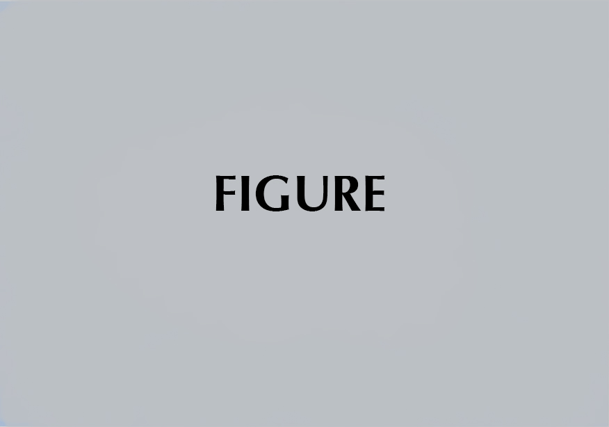

```{r setup, include=FALSE}
# Use fig.process to rename figure files generated by R so that they comply with
# the journal naming policies. Remember to name plot chunks with the format
# "Figure1", "Figure2", etc... You will find the figure files in
# `[...]_files/figure-latex/`.

knitr::opts_chunk$set(
  echo = TRUE,
  out.width="\\reprintcolumnwidth",
  fig.process = function(x) {
    x2 = sub('-\\d+([.][a-z]+)$', '\\1', x)
    if (file.rename(x, x2)) x2 else x
  }
)

# The JASA LaTeX class depends on the LaTeX package "revtex4-1". If you are
# using a full LaTeX distro, you should make sure "revtex4-1" is installed, and
# install it if not. If you are using TinyTeX, the following code will take care
# of installing the package for you.

if (tinytex::is_tinytex() && !tinytex::check_installed('revtex4-1')) {
  tinytex::tlmgr_install("revtex4-1")
}
```

# Introduction

This sample document demonstrates the use of JASA in manuscripts 
prepared for submission to the Journal of the Acoustical Society of America. 

# Figures {#figures}

```{r Figure1, echo=FALSE, fig.cap="Caption."}

```

The only figure formats allowed for submission are the following: `.pdf`, `.ps`, `.eps`, or `.jpg`.
Figure files must be named in this fashion:
`Figure\#.xxx`, where `\#` is the figure number and `xxx` is the file format
(`Figure1.eps`, `Figure2.jpg`, `Figure3a.ps`, `Figure3b.ps`, etc).

```{r Figure2, echo=FALSE, fig.cap="A sine wave."}
t <- seq(0, 10, 0.1)
y <- sin(t)
plot(t, y, type = "l", xlab = "time", ylab = "Sine wave")
```


# Inline and display math samples

You can also include inline math, like $\sum\nolimits_{i=1}^N a_i$.

The following is a matrix.

$$
A_{m,n} = 
 \begin{pmatrix}
  a_{1,1} & a_{1,2} & \cdots & a_{1,n} \\
  a_{2,1} & a_{2,2} & \cdots & a_{2,n} \\
  \vdots  & \vdots  & \ddots & \vdots  \\
  a_{m,1} & a_{m,2} & \cdots & a_{m,n} 
 \end{pmatrix}
$$


# Citations

The code `[@key]` should usually be used for making
citations surrounded by parentheses, where `key` is the BibTeX cite-key.
If you need only the year in parentheses, you may use `@key`.

Some examples:

- Normal journal cite: [@joursamp1]

- Volume number with issue number: [@joursamp3]

- Journal article published online, not yet printed: [published
online, @sampMisc2]

- Book reference: [@booksamp1]

- In press: [in press, @inpress2]

- Website: [@websiteauthyear]

- Inproceedings: [@sampinproceedings3].


<!-- You can add your acknowledgements here (optional). -->
::: {.acknowledgments data-latex=""}
This research was supported by ...
:::

<!-- Use \appendix* for only one appendix section. -->
\appendix 

To start the appendix, use the `\appendix` command.
This signals that all following section commands refer to appendixes
instead of regular sections. Therefore, the `\appendix` command
should be used only once---to set up the section commands to act as
appendices. Thereafter normal section commands are used. The heading
for a section can be left empty. For example,

```latex
\appendix

# 
```

will produce an appendix heading that says "APPENDIX A" and

```latex
\appendix

# Background
```

will produce an appendix heading that says "APPENDIX A: BACKGROUND"
(note that the colon is set automatically).

If there is only one appendix, then the letter "A" should not
appear. This is suppressed by using the star version of the appendix
command (`\appendix*` in the place of `\appendix`).

# A little more on appendices

Observe that this appendix was started by using

```markdown
# A little more on appendices
```

Note the equation number in an appendix:

$$E=mc^2$$

